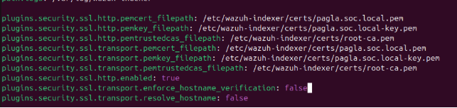

🚀 Deploying Wazuh Indexer and Dashboard: A Step-by-Step Guide
# **Introduction**
As part of my Complete Open Source Security Operations Center (SOC) build project, we will follow Socfortress and Taylor Waltons world best siem stack series and we will find out if we can still implement his work in 2025. In this process we will try to indicate all the trouble we will be facing while implement the project now and how to solve those in august 2025. \
\
In this blog, I’ll walk through:\
\- Installing Wazuh Indexer with full SSL configuration\
\- Securing certificates and permissions\
\- Optimizing the indexer service for performance\
\- Installing and configuring Wazuh Dashboard\
\- Securing the dashboard with SSL and password management\
\
Every command I ran is included here, along with a description so you can follow and understand why each step is necessary.
# **1) Preparing Certificates and Repositories**
Wazuh Indexer relies on certificates to secure communications. First, I downloaded the official certificate generation tool and config file:

***curl -sO https://packages.wazuh.com/4.3/wazuh-certs-tool.sh\
curl -sO https://packages.wazuh.com/4.3/config.yml\
bash ./wazuh-certs-tool.sh -A***

Next, I updated my system and installed required packages:

***sudo apt update\
apt-get install debconf adduser procps\
apt-get install gnupg apt-transport-https***

I imported the Wazuh GPG key and added the official repository:

***curl -s https://packages.wazuh.com/key/GPG-KEY-WAZUH | gpg --no-default-keyring --keyring gnupg-ring:/usr/share/keyrings/wazuh.gpg --import && chmod 644 /usr/share/keyrings/wazuh.gpg\
echo "deb [signed-by=/usr/share/keyrings/wazuh.gpg] https://packages.wazuh.com/4.x/apt/ stable main" | tee -a /etc/apt/sources.list.d/wazuh.list\
apt-get update***
# **2) Installing Wazuh Indexer**
With the repository configured, I installed the Indexer package:

***apt-get -y install wazuh-indexer=4.3.11-1***

# **3) Configuring Wazuh Indexer**
I edited the main configuration file /etc/wazuh-indexer/opensearch.yml:

***network.host: "172.23.189.96"\
node.name: "pagla.soc.local"\
\
cluster.initial\_master\_nodes:\
\- "pagla.soc.local"\
#- "node-2"\
#- "node-3"\
\
cluster.name: "wazuh-cluster"\
\
discovery.seed\_hosts:\
`  `- "pagla.soc.local"\
\#  - "node-2-ip"\
\#  - "node-3-ip"\
\
node.max\_local\_storage\_nodes: "1"\
path.data: /var/lib/wazuh-indexer\
path.logs: /var/log/wazuh-indexer***

#
# **4) Deploying Certificates**
I created a tarball of the generated certificates:

***tar -cvf ./wazuh-certificates.tar -C ./wazuh-certificates/ .***

Then I extracted them into the Indexer’s certs directory:

***NODE\_NAME=pagla.soc.local\
mkdir /etc/wazuh-indexer/certs\
tar -xf ./wazuh-certificates.tar -C /etc/wazuh-indexer/certs/ ./$NODE\_NAME.pem ./$NODE\_NAME-key.pem ./admin.pem ./admin-key.pem ./root-ca.pem\
cd /etc/wazuh-indexer/certs && ls***

Next, I updated the SSL configuration in /etc/wazuh-indexer/opensearch.yml:

***plugins.security.ssl.http.pemcert\_filepath: /etc/wazuh-indexer/certs/pagla.soc.local.pem\
plugins.security.ssl.http.pemkey\_filepath: /etc/wazuh-indexer/certs/pagla.soc.local-key.pem\
plugins.security.ssl.http.pemtrustedcas\_filepath: /etc/wazuh-indexer/certs/root-ca.pem\
\
plugins.security.ssl.transport.pemcert\_filepath: /etc/wazuh-indexer/certs/pagla.soc.local.pem\
plugins.security.ssl.transport.pemkey\_filepath: /etc/wazuh-indexer/certs/pagla.soc.local-key.pem***

# **5) Hardening Permissions**
It’s critical to secure certs with the right ownership and permissions:

***chmod 500 /etc/wazuh-indexer/certs\
chmod 400 /etc/wazuh-indexer/certs/\*\
chown -R wazuh-indexer:wazuh-indexer /etc/wazuh-indexer/certs***
# **6) Performance Optimization**
I enabled memory lock to avoid swapping:

***bootstrap.memory\_lock: true***

Then in the systemd service file /usr/lib/systemd/system/wazuh-indexer.service, I added:

***LimitMEMLOCK=infinity***

Finally, I tuned JVM heap size in /etc/wazuh-indexer/jvm.options:

***-Xms4g\
-Xmx4g***

# 
# **7) Enabling the Indexer**
After all configuration, I reloaded systemd and enabled the service:

***systemctl daemon-reload\
systemctl enable wazuh-indexer\
systemctl start wazuh-indexer***

Then I initialized the cluster security:

***/usr/share/wazuh-indexer/bin/indexer-security-init.sh***

 

 

So its working.
# **8) Installing the Wazuh Dashboard**
Now it was time to install the Wazuh Dashboard:

***apt-get -y install wazuh-dashboard=4.3.11-1***

I created the certs directory and extracted certificates:

***mkdir /etc/wazuh-dashboard/certs\
tar -xf ./wazuh-certificates.tar -C /etc/wazuh-dashboard/certs/ ./$NODE\_NAME.pem ./$NODE\_NAME-key.pem ./root-ca.pem\
cd /etc/wazuh-dashboard/certs && ls***

Set proper ownership and permissions:

***chown -R wazuh-dashboard:wazuh-dashboard /etc/wazuh-dashboard/certs\
chmod 750 /etc/wazuh-dashboard/certs\
chmod 640 /etc/wazuh-dashboard/certs/\*.pem***

Configured TLS in /etc/wazuh-dashboard/opensearch\_dashboards.yml:

***server.ssl.key: "/etc/wazuh-dashboard/certs/pagla.soc.local-key.pem"\
server.ssl.certificate: "/etc/wazuh-dashboard/certs/pagla.soc.local.pem"***

Restarted the service:

***systemctl daemon-reload\
systemctl restart wazuh-dashboard\
systemctl enable wazuh-dashboard***

# **9) Securing the Installation**
I rotated all internal passwords with:

***/usr/share/wazuh-indexer/plugins/opensearch-security/tools/wazuh-passwords-tool.sh --change-all***

Then I updated the Kibana server password in the Wazuh Dashboard keystore:

***echo H0sECEZEAH5voO3u9fTWjN\*oDYroQjKq | /usr/share/wazuh-dashboard/bin/opensearch-dashboards-keystore --allow-root add -f --stdin opensearch.password***

Finally, I restarted the dashboard:

***systemctl restart wazuh-dashboard\
systemctl status wazuh-dashboard***
#
 so we can now call the wazuh-api.

 
# **Conclusion**
In this part of my SOC project, I:\
\- Successfully deployed and configured Wazuh Indexer with SSL\
\- Secured permissions and optimized performance\
\- Installed and secured Wazuh Dashboard with TLS and rotated credentials\
\
This provided the foundation of my SIEM infrastructure, ready to integrate with Graylog, Fluent Bit, Grafana, and pfSense in the next steps.
