Part 3: Installing Wazuh Manager — Log Analysis and Configure Agent Groups in My SOC Project

Part 3: Installing Wazuh Manager — Log Analysis in My SOC Project

In Part 3 of my SOC (Security Operations Center) project, I deployed and configured \*\*Wazuh Manager\*\* on Ubuntu 24.04. Wazuh Manager is the core of the Wazuh ecosystem — it analyzes logs, applies security rules, and generates alerts. I also integrated Wazuh Manager with \*\*Graylog\*\* for centralized log analysis and used \*\*Fluent Bit\*\* as a forwarder for Wazuh alerts.

\---
## **1️⃣ Installing Wazuh Manager**
Wazuh Manager is the heart of your SOC pipeline. Here’s how I installed it.

\*\*Step 1: Install prerequisites\*\*\
sudo apt update\
sudo apt install -y gnupg apt-transport-https curl

\*\*Step 2: Import Wazuh GPG key\*\*\
curl -s https://packages.wazuh.com/key/GPG-KEY-WAZUH |   gpg --no-default-keyring --keyring gnupg-ring:/usr/share/keyrings/wazuh.gpg --import\
sudo chmod 644 /usr/share/keyrings/wazuh.gpg

\*\*Step 3: Add Wazuh repo for version 4.x stable\*\*\
echo "deb [signed-by=/usr/share/keyrings/wazuh.gpg] https://packages.wazuh.com/4.x/apt/ stable main" |   sudo tee /etc/apt/sources.list.d/wazuh.list

\*\*Step 4: Update packages\*\*\
sudo apt update

\*\*Step 5: Install Wazuh Manager 4.3.11\*\*\
sudo apt install -y wazuh-manager=4.3.11-1\
systemctl daemon-reload\
systemctl enable wazuh-manager\
systemctl start wazuh-manager\
ps aux | grep wazuh

✅ Wazuh Manager is now running.

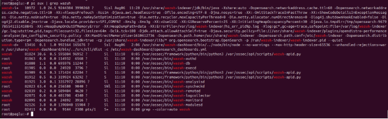
## **2️⃣ Forwarding Logs to Graylog**
Wazuh generates alerts in alerts.json. To analyze these logs in Graylog:

1\. In \*\*Graylog WebUI → System → Inputs\*\*, create a \*\*Raw/Plaintext TCP input\*\* (e.g., port 5555).\
2\. Fluent Bit will tail alerts.json and forward logs to Graylog’s TCP input.

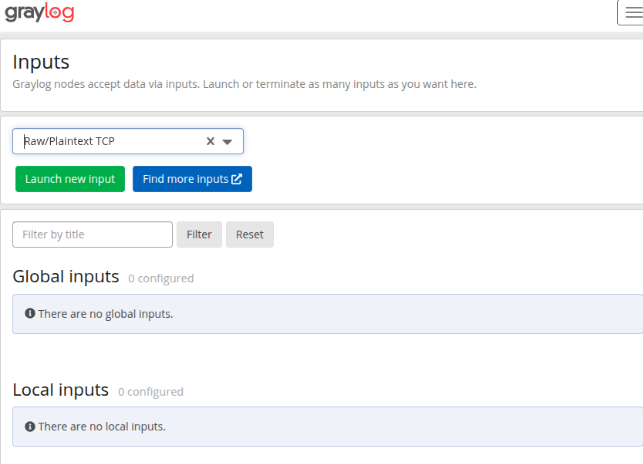
## 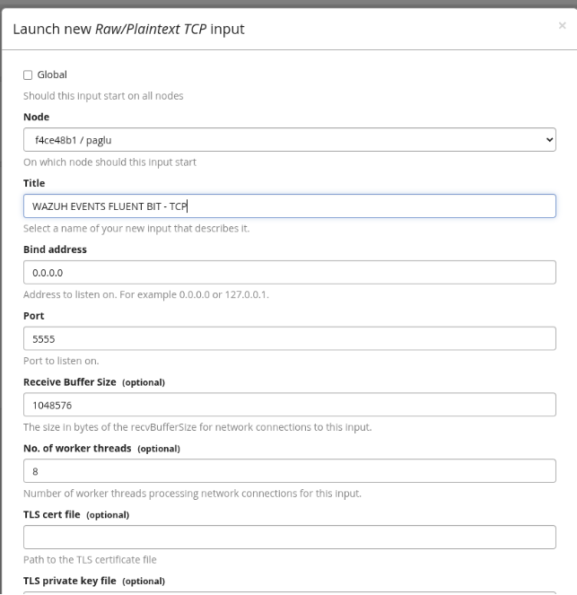
**input is now running. But it is not sending anything.** 

**  

## 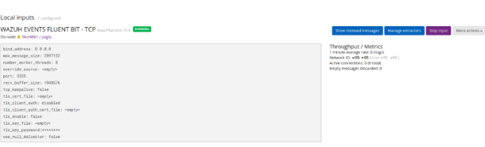
**So everythime wazuh recieves a log it will write it to alerts.json file. So what we need fluentbit for is to pick up the file and send it to graylog.Then graylog will do further analysis and write it to wazuh indexer.** 
##
## **3️⃣ Installing Fluent Bit**
\*\*Step 1: Install Fluent Bit\*\*\
FLUENT\_BIT\_RELEASE\_VERSION=1.8.1 curl https://raw.githubusercontent.com/fluent/fluent-bit/master/install.sh | sh

\*\*Step 2: Configure Fluent Bit\*\*\
Edit /etc/fluent-bit/fluent-bit.conf:\
[SERVICE]\
`    `flush        5\
`    `daemon       Off\
`    `log\_level    info\
`    `parsers\_file parsers.conf\
`    `plugins\_file plugins.conf\
`    `http\_server  Off\
`    `http\_listen  0.0.0.0\
`    `http\_port    2020\
`    `storage.metrics on\
`    `storage.path /var/log/flb-storage/\
`    `storage.sync normal\
`    `storage.checksum off\
`    `storage.backlog.mem\_limit 5M\
`    `Log\_File /var/log/td-agent-bit.log

[INPUT]\
`    `name  tail\
`    `path  /var/ossec/logs/alerts/alerts.json\
`    `tag wazuh\
`    `parser  json\
`    `Buffer\_Max\_Size 5MB\
`    `Buffer\_Chunk\_Size 400k\
`    `storage.type      filesystem\
`    `Mem\_Buf\_Limit     512MB

[OUTPUT]\
`    `Name  tcp\
`    `Host  172.23.189.96\
`    `Port  5555\
`    `net.keepalive off\
`    `Match wazuh\
`    `Format  json\_lines\
`    `json\_date\_key true

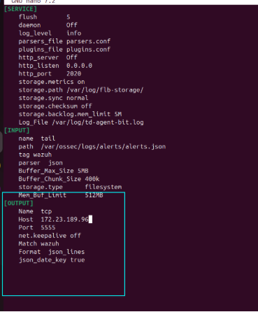

\*\*Step 3: Modify systemd service\*\*\
Edit /usr/lib/systemd/system/fluent-bit.service:\
ExecStart=/opt/fluent-bit/bin/fluent-bit -c /etc/fluent-bit/fluent-bit.conf

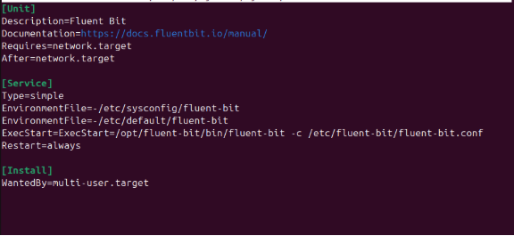

Enable and start Fluent Bit:\
sudo systemctl start fluent-bit\
sudo systemctl enable fluent-bit\
sudo systemctl status fluent-bit\
Check logs:\
tail -f /var/log/td-agent-bit.log

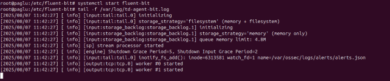

**SO this will be actually my graylogs input.** 

✅ Fluent Bit is forwarding Wazuh alerts to Graylog.

## **4️⃣ Verify Wazuh Alerts**
tail -f /var/ossec/logs/alerts/alerts.json\
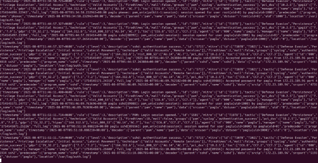

You should see alerts in JSON format.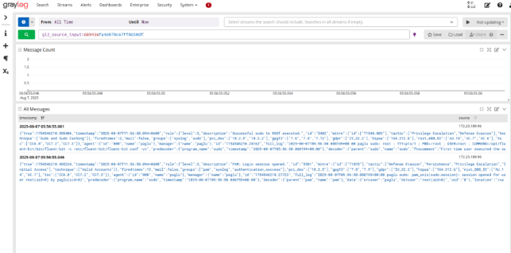

**So it is working.  So we have now deployed our wazuh manager and we have connected it to graylog and we verifiy that we r sending json file to graylog.** 
## **5️⃣ Secure Wazuh Manager**
Require a password for agent registration.

Edit /var/ossec/etc/ossec.conf and configure <auth>.

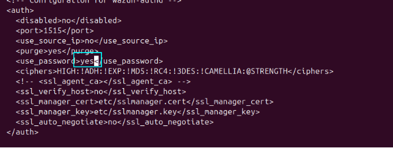

Create a password file:\
echo "keblakantordhon1" > /var/ossec/etc/authd.pass\
chmod 640 /var/ossec/etc/authd.pass\
chown root:wazuh /var/ossec/etc/authd.pass

## **6️⃣ Enable Vulnerability Detection**
Enable Wazuh’s built-in vulnerability detection in /var/ossec/etc/ossec.conf.

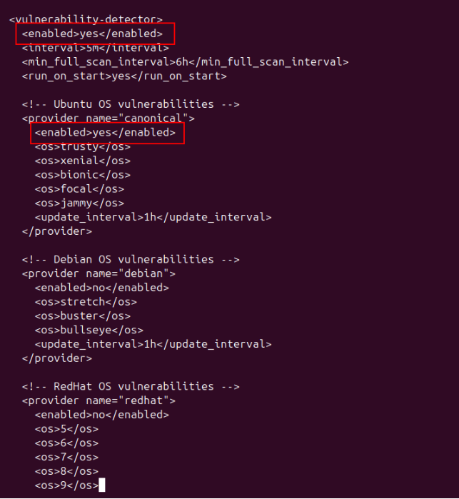
##
## **7️⃣ Configure Agent Groups**
Organize agents into groups for centralized management:\
\- Linux: SOCFortress Guide\
\- Windows: SOCFortress Guide

Linux Group: From <https://socfortress.medium.com/part-3-wazuh-manager-install-log-analysis-e819f28b0f9e> 

Windows Group: from <https://socfortress.medium.com/part-3-wazuh-manager-install-log-analysis-e819f28b0f9e> 

## **8️⃣ Add Advanced Detection Rules**
Import SOCFortress community rules:\
curl -so ~/wazuh\_socfortress\_rules.sh https://raw.githubusercontent.com/socfortress/Wazuh-Rules/main/wazuh\_socfortress\_rules.sh && bash ~/wazuh\_socfortress\_rules.sh

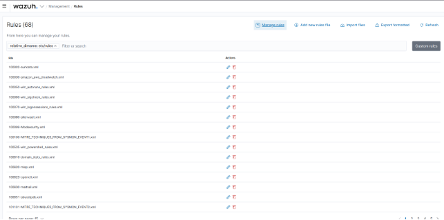
## ** 

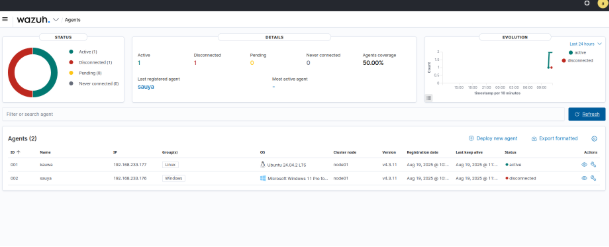**I also have two agents installed for this project in vms.**
**\

## **✅ Conclusion**
At this stage, I have:

\- Installed Wazuh Manager for log analysis.\
\- Configured Graylog Input to receive Wazuh alerts.\
\- Set up Fluent Bit to forward alerts from alerts.json to Graylog.\
\- Secured Wazuh Manager with password authentication.\
\- Enabled vulnerability detection and imported custom SOCFortress rules.

🚀 My Wazuh Manager is now fully integrated into the SOC pipeline, sending structured security alerts to Graylog for analysis and indexing.
