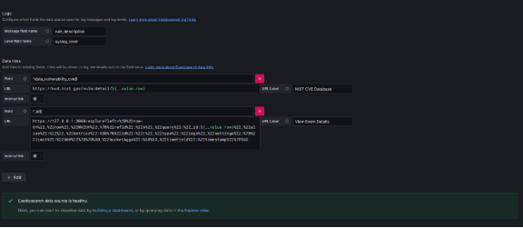
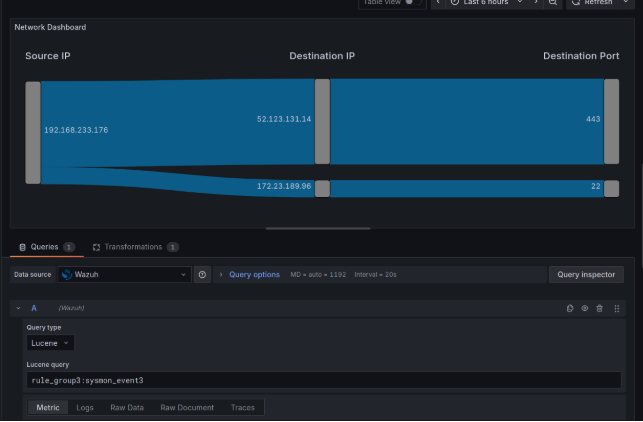
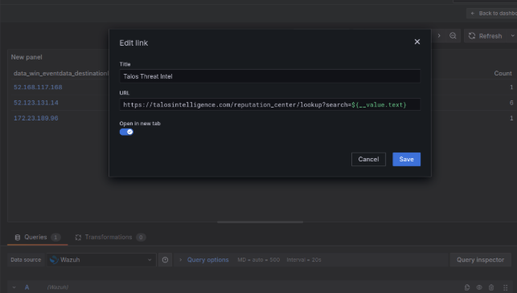
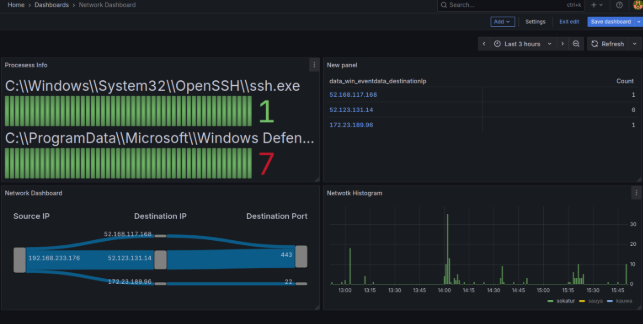
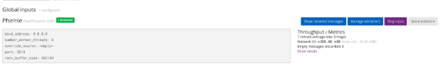
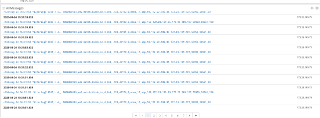

Best Open Source SIEM Dashboards — Installing Grafana on Ubuntu

Part 6: Best Open Source SIEM Dashboards — Installing Grafana on Ubuntu

In Part 6 of my SOC project, I focused on setting up \*\*Grafana\*\*, one of the best open-source dashboarding tools, to visualize and analyze data coming from Wazuh and Graylog. With Grafana, I can build interactive dashboards, visualize logs, and connect threat intelligence for faster incident response.

\---
## **1️⃣ Installing Grafana on Ubuntu**
To install \*\*Grafana OSS\*\* from the APT repository, follow these steps:

\*\*Step 1: Install prerequisites\*\*\
sudo apt-get install -y apt-transport-https software-properties-common wget

\*\*Step 2: Import the GPG key\*\*\
sudo mkdir -p /etc/apt/keyrings/\
wget -q -O - https://apt.grafana.com/gpg.key | gpg --dearmor | sudo tee /etc/apt/keyrings/grafana.gpg > /dev/null

\*\*Step 3: Add Grafana repository\*\*\
echo "deb [signed-by=/etc/apt/keyrings/grafana.gpg] https://apt.grafana.com stable main" | sudo tee -a /etc/apt/sources.list.d/grafana.list

\*\*Step 4: Update package list\*\*\
sudo apt-get update

\*\*Step 5: Install Grafana OSS\*\*\
sudo apt-get install grafana

\*\*Step 6: Start and enable the service\*\*\
sudo systemctl daemon-reload\
sudo systemctl enable --now grafana-server\
sudo systemctl status grafana-server

✅ Grafana is now running on my server.

\---
## **2️⃣ Enabling HTTPS with Custom Certs**
To secure Grafana with HTTPS using \*\*Wazuh Indexer certificates\*\*:

\*\*Step 1: Copy certificates\*\*\
sudo mkdir /etc/grafana/certs\
sudo cp /etc/wazuh-indexer/certs/wazuh-indexer.pem /etc/grafana/certs/\
sudo cp /etc/wazuh-indexer/certs/wazuh-indexer-key.pem /etc/grafana/certs/

\*\*Step 2: Set ownership and permissions\*\*\
sudo chown -R grafana:grafana /etc/grafana/certs/\
sudo chmod 400 /etc/grafana/certs/\*

\*\*Step 3: Edit Grafana configuration\*\*\
Open /etc/grafana/grafana.ini and enable the following:\
protocol = https\
http\_port = 3000\
cert\_file = /etc/grafana/certs/wazuh-indexer.pem\
cert\_key = /etc/grafana/certs/wazuh-indexer-key.pem

\*\*Step 4: Restart Grafana\*\*\
systemctl start grafana-server

Now lets  visit https://localhost:3000 → login with admin:admin (change password on first login).

\---
## **3️⃣ Setting Up Grafana for Wazuh Access**
To let Grafana query the \*\*Wazuh Indexer\*\*:

\*\*Step 1: Create role in Wazuh Dashboards\*\*\
\- Go to Security > Roles\
\- Create grafana\_role with permissions:\
`  `- Cluster: cluster\_monitor\
`  `- Index: read, indices:admin/mappings/get on \*\
`  `- Tenant: global\_tenant → Read only

\*\*Step 2: Map user to the role\*\*\
\- Go to Security > Internal Users, create user grafana with password\
\- Map the grafana user to the new role

This gives Grafana read-only access to all indices.

\---
## **4️⃣ Connecting Grafana to Wazuh Indexer**
\*\*Step 1: Install OpenSearch plugin\*\*\
In Grafana → Data Sources → Add Plugins → Install OpenSearch.

\*\*Step 2: Configure data source\*\*\
\- Name: Wazuh\
\- URL: https://127.0.0.1:9200\
\- Authentication: Basic Auth (use grafana user)\
\- Skip TLS Verify: enabled (self-signed certs)\
\- Index Name: <myIndexName>\* (e.g., wazuh-alerts-castledefender\*)\
\- Time Field: timestamp\
\- Logs → Message field: rule\_description\
\- Level field: syslog\_level

\*\*Step 3: Add Data Links\*\*\
\- CVE lookup:\
`  `- Field: ^data\_vulnerability\_cve$\
`  `- URL: https://nvd.nist.gov/vuln/detail/${\_\_value.raw}\
`  `- Label: NIST CVE Database\
\- Event lookup:\
`  `- Field: ^\_id$\
`  `- URL: Grafana Explore link with ID\
`  `- Label: View Event Details

✅ Data Links let me cross-reference vulnerabilities and logs quickly.

\---
## **5️⃣ Using Grafana**
Before dashboards, test queries:\
\- Go to Explore → select Wazuh data source\
\- Run basic queries to confirm connection
##
## **6️⃣ Building a Dashboard**
I installed the \*\*Sankey plugin\*\* to visualize relationships in logs.

grafana-cli plugins install netsage-sankey-panel\
systemctl restart grafana-server

Now in Grafana, I can:

\*\*Step 1: Identify log fields\*\* (via Graylog)\
\- Example search: rule\_group2: sysmon\_eid3\_detections\
\- Fields: data\_win\_eventdata\_sourceIp, data\_win\_eventdata\_destinationIp, data\_win\_eventdata\_destinationPort

\*\*Step 2: Create Sankey Panel\*\*\
\- Group By → fields: source IP → destination IP → destination Port\
\- Transformations → Organize Fields by Name

\- Rename fields: SOURCE IP, DESTINATION IP, DESTINATION PORT

\*\*Step 3: Save Dashboard\*\*\
✅ Interactive network connection visualization is ready.

Now lets inegrate talos with the results.

## **7️⃣ Next Step: Integrating pfSense**
Finally, I connected \*\*pfSense firewall logs\*\* into the pipeline, enriching the SOC with network traffic visibility.

 

## **✅ Conclusion**
In this stage, I:\
\- Installed Grafana on Ubuntu\
\- Secured Grafana with HTTPS using Wazuh certs\
\- Configured Wazuh Indexer access for Grafana\
\- Added OpenSearch data source and Data Links\
\- Built dashboards using Sankey plugin for network log visualization\
\- Prepared pfSense integration for extended monitoring

🚀 Grafana now provides a powerful, open-source SIEM dashboard, letting me correlate security events across Wazuh, Graylog, and pfSense.
